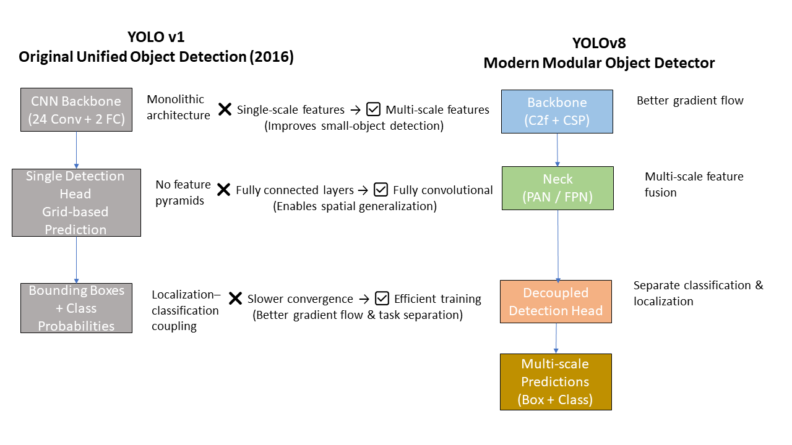

# YOLO Architecture Reasoning: From v1 to Modern Variants

## Motivation
Object detection systems are often evaluated primarily through benchmarks such as mAP and inference speed. While these metrics are important, they do not explain *why* a particular architecture performs well or *why* certain design decisions persist across generations of models.

YOLO (You Only Look Once) represents a major shift in object detection by framing detection as a single regression problem rather than a multi-stage pipeline. Understanding the architectural reasoning behind YOLO—especially its early design choices—provides insight into how constraints such as real-time inference, computational efficiency, and end-to-end optimization shape modern deep learning systems.

This project focuses on reasoning about YOLO’s architectural structure rather than reproducing results, with the goal of developing deeper intuition about model design tradeoffs that generalize beyond a single algorithm.

## Problem Statement
The central question of this project is: *why is YOLO architected the way it is, and how do those architectural choices influence detection behavior?*

While YOLO is often presented as a fast and unified detector, many explanations focus on *what* layers exist rather than *why* they are arranged in a particular manner. During earlier coursework, I explored YOLO primarily at a descriptive level, which left important gaps in understanding regarding architectural tradeoffs, design constraints, and failure modes.

This project reframes the problem as an architectural reasoning exercise. Rather than proposing a new model or reproducing benchmark results, the goal is to analyze YOLO’s design decisions—such as grid-based prediction, shared feature extraction, and joint localization-classification—and reason about how these choices emerge from constraints like real-time inference, computational efficiency, and end-to-end optimization.

## Background: YOLO v1
YOLO v1 introduced a unified approach to object detection by treating the task as a single regression problem. Instead of generating region proposals followed by classification, YOLO processes the entire image through a convolutional network and directly predicts bounding boxes and class probabilities in one forward pass.

The model divides the input image into a fixed grid, with each grid cell responsible for predicting bounding boxes and confidence scores. This design enforces a global reasoning process, allowing the network to learn contextual relationships across the full image rather than relying on local proposals.

While this approach dramatically improves inference speed, it also introduces limitations, particularly in handling small objects and multiple objects within the same grid cell. These limitations are not accidental flaws but consequences of deliberate architectural choices made to prioritize real-time performance and end-to-end simplicity.

## Architectural Comparison: YOLOv1 vs YOLOv8

## Key Architectural Decisions in YOLO
One of the most significant architectural decisions in YOLO is the use of grid-based prediction, where each grid cell is responsible for detecting objects whose centers fall within it. This choice simplifies detection into a structured regression problem but also imposes constraints on how many objects can be detected per spatial region.

Another key decision is the use of a shared convolutional backbone for both localization and classification. By extracting features jointly for bounding box prediction and class probability estimation, YOLO enforces tight coupling between spatial and semantic understanding. This coupling improves efficiency and enables end-to-end optimization, but it can reduce flexibility compared to multi-stage detectors that decouple these tasks.

YOLO’s architecture also reflects a strong bias toward global reasoning. Because predictions are made after processing the entire image, the model implicitly learns contextual relationships across object classes and background regions. This global perspective contributes to robustness against false positives but can lead to coarse localization when fine-grained spatial precision is required.

## Evolution Beyond YOLO v1
Subsequent versions of YOLO build directly on the constraints revealed by the original design. Later architectures introduce changes aimed at improving localization accuracy, multi-scale detection, and feature reuse while preserving the core philosophy of real-time, end-to-end detection.

One major evolution is the introduction of multi-scale prediction, which addresses YOLO v1’s difficulty with small objects. By allowing predictions at different spatial resolutions, later YOLO variants relax the rigid grid constraints without abandoning unified detection. This reflects a shift from fixed spatial responsibility toward more flexible feature hierarchies.

Other architectural refinements, such as deeper convolutional backbones, residual connections, and anchor-based bounding box prediction, further balance speed and accuracy. Importantly, these changes do not replace YOLO’s original design philosophy but rather refine it, showing how architectural systems evolve through incremental constraint relaxation rather than wholesale redesign.

## Tradeoffs and Design Reasoning
YOLO’s architectural design reflects a series of explicit tradeoffs rather than attempts to optimize a single metric. One of the most prominent tradeoffs is speed versus localization precision. By prioritizing a single forward pass and global prediction, YOLO achieves real-time performance at the cost of fine-grained spatial accuracy, particularly for small or densely packed objects.

Another key tradeoff is simplicity versus flexibility. YOLO’s unified architecture reduces system complexity and makes end-to-end training feasible, but it limits the model’s ability to adapt specialized components for different subtasks. In contrast, multi-stage detectors gain flexibility by decoupling proposal generation and classification, but at the expense of latency and engineering complexity.

These tradeoffs illustrate a broader design philosophy: YOLO is not optimized to be universally optimal, but to be predictably efficient under real-world constraints. Understanding these compromises clarifies why YOLO continues to evolve incrementally rather than abandoning its original architectural principles.

### Design Tradeoffs Summary

| Design Choice | Benefit | Cost |
|--------------|--------|------|
| Multi-scale features | Improves small-object detection | Increased computation |
| Decoupled head | Faster convergence and stability | More parameters |
| Fully convolutional design | Better spatial generalization | Reduced global context |

## What I Would Explore With More Compute
With access to larger compute resources, I would explore how architectural constraints in YOLO interact with data scale and feature hierarchy depth. One concrete direction would be to systematically vary grid resolution and feature map depth to study how localization error and class confusion change across object sizes.

Another area of interest would be analyzing attention-based or adaptive spatial mechanisms within the YOLO framework, not as replacements, but as controlled augmentations. This would help isolate whether performance gains come from increased representational flexibility or simply from added computational capacity.

Rather than pursuing benchmark improvements directly, these experiments would be designed to probe *why* certain architectural relaxations improve performance and where diminishing returns emerge.

## Scope and Limitations

This project is intentionally scoped as an architectural reasoning exercise rather than an empirical evaluation. It does not attempt to reproduce benchmark results, train models, or compare quantitative metrics across YOLO variants.

The analysis focuses on conceptual design tradeoffs and high-level architectural evolution. As a result, conclusions drawn here are qualitative and may not capture implementation-specific optimizations present in modern production systems.

Despite these limitations, the project aims to build transferable intuition about model design under real-world constraints, which can inform future experimental or empirical work.

## Reflections
This project began as an attempt to revisit earlier coursework that focused more on describing YOLO’s architecture than understanding its underlying design logic. By reframing the task as an architectural reasoning exercise, my understanding shifted from identifying components to analyzing constraints, tradeoffs, and system-level behavior.

One key takeaway is that effective model design is often driven less by theoretical optimality and more by practical constraints such as latency, simplicity, and robustness. Studying YOLO through this lens has influenced how I now approach learning new architectures, emphasizing *why* decisions are made rather than merely *what* is implemented.

This experience reinforced the value of iterative learning and critical reflection, particularly in complex and rapidly evolving fields like machine learning, where progress often comes from refining understanding rather than starting from scratch.
